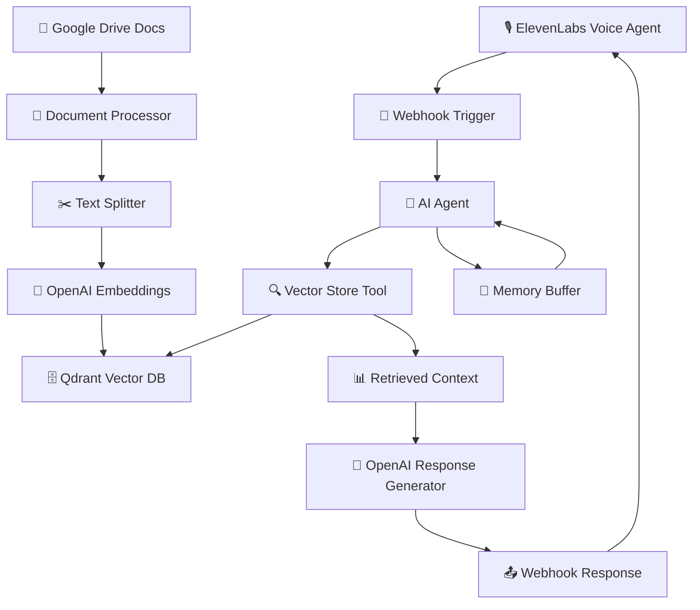

<div align="center">

# 🎙️ Voice RAG Assistant with ElevenLabs

### *Conversational AI That Knows Your Business Inside Out*

[](https://n8n.io/)
[](https://elevenlabs.io/)
[](https://openai.com/)
[](https://qdrant.tech/)
[](https://drive.google.com/)

*Transform your knowledge base into an intelligent voice assistant that speaks your business*

[🚀 Quick Start](#-quick-start) • [🎯 Features](#-features) • [🛠️ Setup](#️-installation--setup) • [🎙️ Voice Demo](#️-voice-integration) • [📊 RAG System](#-rag-system)

</div>

---

## 🎯 **What This Does**

Imagine having a **voice-powered knowledge expert** that:
- 🎙️ **Listens and speaks** naturally with human-like conversation
- 📚 **Knows your documents** inside and out through advanced RAG
- 🧠 **Understands context** and provides accurate, source-backed answers
- ⚡ **Responds instantly** with relevant information from your knowledge base
- 🌐 **Integrates anywhere** with a simple web widget

**Result?** Your customers and team get instant voice access to all your business knowledge, 24/7.

---

## ✨ **Key Features**

### 🎙️ **Natural Voice Interaction**
- **ElevenLabs Integration**: Premium text-to-speech and voice recognition
- **Conversational Flow**: Maintains context across multi-turn conversations
- **Human-like Responses**: Natural speech patterns and intonation

### 📚 **Advanced RAG System**
- **Document Intelligence**: Automatically processes PDFs, docs, and text files
- **Vector Search**: Lightning-fast semantic search through Qdrant database
- **Context Retrieval**: Finds most relevant information for accurate responses
- **Source Attribution**: Responses backed by your actual documents

### 🧠 **AI-Powered Understanding**
- **OpenAI Integration**: GPT models for intelligent response generation
- **Memory Management**: Remembers conversation history for better context
- **Smart Chunking**: Optimized document splitting for better retrieval

### 🌐 **Easy Integration**
- **Web Widget**: Drop-in voice assistant for any website
- **Webhook Architecture**: Real-time communication between voice and knowledge
- **Scalable Design**: Handle multiple conversations simultaneously

---

## 🏗️ **System Architecture**



---

## 📋 **What You Get**

### 🎙️ **Complete Voice RAG System**
- ✅ Pre-configured n8n workflow with 15+ specialized nodes
- ✅ ElevenLabs conversational AI agent setup
- ✅ Qdrant vector database integration
- ✅ Advanced RAG implementation

### 📚 **Document Processing Pipeline**
- ✅ Google Drive integration for document sync
- ✅ Automatic text extraction and chunking
- ✅ Vector embedding generation
- ✅ Smart document indexing

### 🛠️ **Integration Components**
- ✅ Webhook endpoints for real-time communication
- ✅ Memory management for conversation context
- ✅ Error handling and failover mechanisms
- ✅ Scalable architecture design

### 📖 **Comprehensive Documentation**
- ✅ Step-by-step setup guides
- ✅ ElevenLabs agent configuration
- ✅ Qdrant database setup
- ✅ Troubleshooting and optimization tips

---

## 🚀 **Quick Start**

### **Prerequisites**
```bash
✓ n8n instance (cloud or self-hosted)
✓ ElevenLabs account with API access
✓ OpenAI API key
✓ Qdrant database (cloud or self-hosted)
✓ Google Drive with documents
✓ 30 minutes setup time
```

### **1-Click Deploy**
```bash
# Import the workflow
1. Download: voice-rag-chatbot-workflow.json
2. Import to n8n: Settings > Import from file
3. Configure all credentials (see setup guide)
4. Update collection names and URLs
5. Test the voice assistant! 🎙️
```

---

## 🛠️ **Installation & Setup**

<details>
<summary><b>🎙️ ElevenLabs Agent Configuration</b></summary>

### Step 1: Create Conversational Agent
1. Go to [ElevenLabs Conversational AI](https://elevenlabs.io/conversational-ai)
2. Create new agent (e.g., "business_assistant")
3. Configure voice settings and personality

### Step 2: System Prompt Setup
```
You are an intelligent assistant for [COMPANY NAME]. 
When users ask questions, use the "knowledge_search" tool to find relevant information from our knowledge base. 
Provide clear, helpful answers based on the retrieved information.
Always maintain a professional and friendly tone.
```

### Step 3: Webhook Tool Configuration
- **Tool Name**: `knowledge_search`
- **Description**: "Search the company knowledge base for information"
- **Webhook URL**: Your n8n webhook endpoint
- **Method**: POST
- **Body Parameters**: 
  - `question` (string): The user's question to search for

</details>

<details>
<summary><b>🗄️ Qdrant Vector Database Setup</b></summary>

### Cloud Setup (Recommended)
1. Create account at [Qdrant Cloud](https://cloud.qdrant.io/)
2. Create new cluster
3. Note your cluster URL and API key

### Self-Hosted Setup
```bash
# Docker deployment
docker run -p 6333:6333 qdrant/qdrant

# Or using docker-compose
version: '3.8'
services:
  qdrant:
    image: qdrant/qdrant
    ports:
      - "6333:6333"
    volumes:
      - ./qdrant_storage:/qdrant/storage
```

### Collection Configuration
```javascript
// Update in workflow nodes
{
  "QDRANTURL": "your-qdrant-cluster-url",
  "COLLECTION": "your-collection-name"
}
```

</details>

<details>
<summary><b>📁 Google Drive Integration</b></summary>

### Step 1: Enable Google Drive API
1. Go to [Google Cloud Console](https://console.cloud.google.com/)
2. Enable Google Drive API
3. Create OAuth 2.0 credentials

### Step 2: Organize Documents
```
📁 knowledge-base/
├── 📄 company-policies.pdf
├── 📄 product-documentation.docx
├── 📄 faq.txt
└── 📁 procedures/
    ├── 📄 onboarding-guide.pdf
    └── 📄 troubleshooting.docx
```

### Step 3: Configure n8n Node
- Set folder ID in "Get folder" node
- Ensure proper file permissions
- Test document retrieval

</details>

---

## 🎙️ **Voice Integration**

### 🌐 **Web Widget Setup**
```html
<!-- Add to your website -->
<elevenlabs-convai agent-id="YOUR_AGENT_ID"></elevenlabs-convai>
<script src="https://elevenlabs.io/convai-widget/index.js" async type="text/javascript"></script>
```

### 📱 **Mobile Integration**
```javascript
// React Native example
import { ElevenLabsWidget } from '@elevenlabs/react-native';

<ElevenLabsWidget agentId="YOUR_AGENT_ID" />
```

### 🎚️ **Customization Options**
```javascript
// Advanced widget configuration
<elevenlabs-convai 
  agent-id="YOUR_AGENT_ID"
  theme="dark"
  position="bottom-right"
  welcome-message="Hi! Ask me anything about our company."
  placeholder="Speak or type your question..."
></elevenlabs-convai>
```

---

## 📊 **RAG System Deep Dive**

### 🧠 **How RAG Works Here**

1. **Document Ingestion**
   ```
   📄 Documents → 🔄 Processing → ✂️ Chunking → 🔢 Embeddings → 🗄️ Vector Store
   ```

2. **Query Processing**
   ```
   🎙️ Voice Question → 📝 Transcription → 🔍 Vector Search → 📊 Context Retrieval
   ```

3. **Response Generation**
   ```
   📊 Retrieved Context + 💭 Conversation History → 🤖 LLM Processing → 🎙️ Voice Response
   ```

### ⚙️ **Configuration Options**

```javascript
// Chunking Strategy
{
  "chunkSize": 300,        // Tokens per chunk
  "chunkOverlap": 30,      // Overlap between chunks
  "splitterType": "token"  // Token-based splitting
}

// Retrieval Settings
{
  "topK": 5,              // Number of chunks to retrieve
  "scoreThreshold": 0.7,   // Minimum similarity score
  "searchType": "semantic" // Semantic vs keyword search
}

// Response Generation
{
  "temperature": 0.7,      // Response creativity
  "maxTokens": 500,        // Response length limit
  "systemPrompt": "custom" // Behavior instructions
}
```

---

## 🔧 **Advanced Customization**

### 🎨 **Voice Personality**
```javascript
// ElevenLabs agent configuration
{
  "voice": "professional_female",
  "speed": 1.0,
  "stability": 0.8,
  "clarity": 0.9,
  "style": "conversational"
}
```

### 📚 **Document Types Supported**
- ✅ **PDFs**: Automatic text extraction
- ✅ **Google Docs**: Native integration
- ✅ **Word Documents**: Full content processing
- ✅ **Text Files**: Direct ingestion
- ✅ **Markdown**: Formatted content handling

### 🔍 **Search Enhancement**
```javascript
// Advanced search strategies
{
  "hybridSearch": true,     // Combine semantic + keyword
  "metadataFiltering": {    // Filter by document properties
    "department": "support",
    "lastUpdated": "2024"
  },
  "rerankResults": true     // Re-score results for relevance
}
```

---

## 📈 **Performance Optimization**

### ⚡ **Speed Optimizations**
- **Parallel Processing**: Multiple document chunks simultaneously
- **Caching Strategy**: Cache frequent queries and responses
- **Connection Pooling**: Efficient database connections

### 💰 **Cost Optimizations**
- **Smart Chunking**: Optimize chunk sizes for cost/quality balance
- **Model Selection**: Choose appropriate OpenAI models per use case
- **Embedding Efficiency**: Batch embedding generation

### 📊 **Performance Metrics**

| Metric | Target | Typical Range |
|--------|--------|---------------|
| **Response Time** | <3s | 1-5s |
| **Accuracy** | >90% | 85-95% |
| **Voice Quality** | High | ElevenLabs Premium |
| **Retrieval Precision** | >80% | 75-90% |

---

## 🛡️ **Security & Privacy**

### 🔒 **Data Protection**
- ✅ Encrypted vector storage in Qdrant
- ✅ Secure API communications (HTTPS/TLS)
- ✅ Access control for knowledge base
- ✅ GDPR-compliant data handling

### 🔐 **Access Controls**
- ✅ API key rotation support
- ✅ Role-based access to documents
- ✅ Audit logging for all interactions
- ✅ Rate limiting and abuse prevention

---

## 🚀 **Scaling Your Implementation**

### 📊 **Capacity Planning**

| Scale Level | Concurrent Users | Documents | Monthly Cost* |
|-------------|------------------|-----------|---------------|
| **Startup** | 10-50 | 100-500 | $50-150 |
| **SMB** | 100-500 | 1K-5K | $200-600 |
| **Enterprise** | 1K+ | 10K+ | $1K-3K |

*Estimated costs including OpenAI, ElevenLabs, and Qdrant

### 🎯 **Growth Roadmap**
1. **Week 1**: Basic voice RAG setup
2. **Week 2**: Document processing optimization
3. **Week 3**: Advanced search and filtering
4. **Month 2**: Multi-language support
5. **Month 3**: Analytics and insights dashboard

---

## 🔍 **Troubleshooting**

<details>
<summary><b>❌ Common Issues & Solutions</b></summary>

### **Issue**: Voice agent not responding
**Solution**: 
1. Check webhook URL in ElevenLabs
2. Verify n8n workflow is active
3. Test webhook endpoint manually

### **Issue**: Poor search results
**Solution**:
1. Review document chunking strategy
2. Adjust similarity thresholds
3. Improve document quality and formatting

### **Issue**: Slow response times
**Solution**:
1. Optimize vector database configuration
2. Implement result caching
3. Use faster embedding models

</details>

---

## 🤝 **Contributing**

We welcome contributions for:
- 🎙️ **Voice interface improvements**
- 📚 **New document type support**
- 🔍 **Search algorithm enhancements**
- 🌐 **Integration expansions**

### **Development Setup**
```bash
git clone https://github.com/yourusername/voice-rag-chatbot-n8n.git
cd voice-rag-chatbot-n8n
# Import workflow to your n8n instance
# Configure credentials and test
# Submit pull request with improvements
```

---

## 📞 **Support & Community**

- 🎙️ **Voice Demo**: [Try it live](https://demo.yoursite.com)
- 💬 **Discord**: [Join our community](https://discord.gg/your-server)
- 📖 **Documentation**: [Complete setup guide](https://docs.yoursite.com)
- 🐛 **Issues**: [GitHub Issues](https://github.com/yourusername/voice-rag-chatbot-n8n/issues)

---

## 📄 **License**

This project is licensed under the MIT License - see the [LICENSE](LICENSE) file for details.

---

<div align="center">

### 🌟 **Ready to Give Your Knowledge Base a Voice?**

**Deploy in 30 minutes • Voice responses in 3 seconds**

[⬇️ Download Now](https://github.com/yourusername/voice-rag-chatbot-n8n/releases) • [📚 Setup Guide](https://docs.yoursite.com) • [🎙️ Live Demo](https://demo.yoursite.com)

---

*Made with ❤️ for businesses that want to make knowledge accessible through voice*

**Star ⭐ this repo if it helped you build an amazing voice assistant!**

</div>
